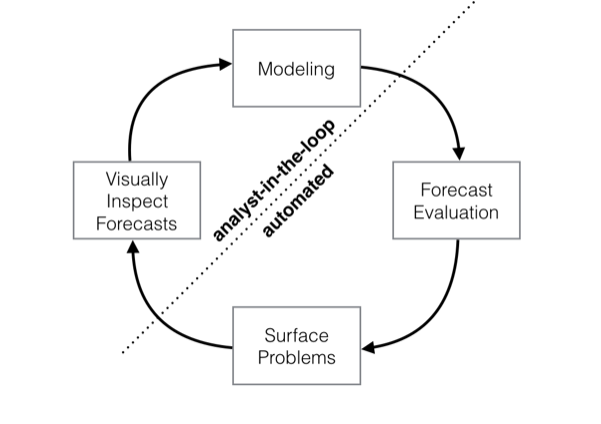
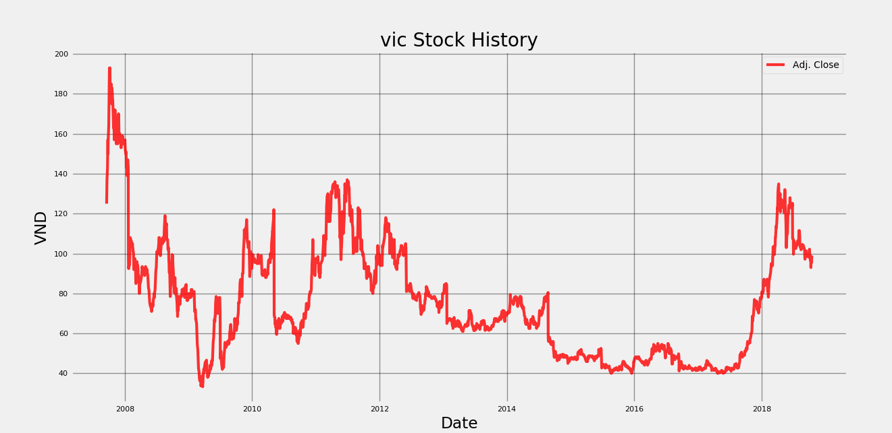
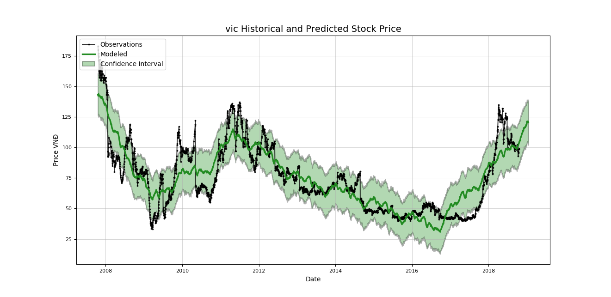
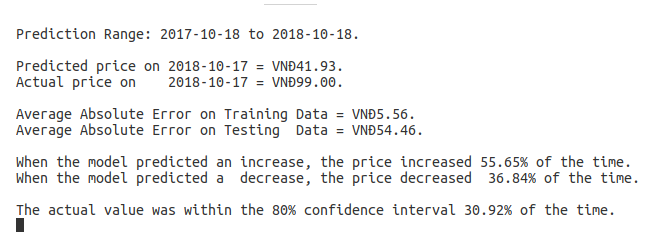

# VNIndex Stock price prediction tool (Ho Chi Minh Securities Exchange)

## Outline Detail

### **Section 1: Stock Price Forecasting with Analyst in the loop**
#### 1.1 Problem proposal
**Stock price forecasting**

Stock price forecasting is a intimidating job as the nature of the market is volatile and strongly dependent from many aspects of the economy such as financial reports, politics and even un-official news source. Therefore, predicting the stock market is more or less a motivating challenge that data analysts are trying to break the code.

In the scope of this project, we will use Facebook prophet to analyse the top 30 index from VNIndex. Prophet is a additive model enable analysts to produce faster, more flexible model using tunable paramaters. Although FBprophet has a better perfomance in modelling the forecast, it gives inferior accuracy comparing to Neural Network. However, with the votality of the stock market, FBProphet is more suitable choice for this project as it put Analyst in the loop, who can quickly create predictve time-series models and make preemptive action from such models.

The main goal of this project is not to out-play the professional broker whose day-by-day job is to use their technical skills to assess the stock market, but to help them better analyse the data and visualize the prediction.

**Problems with Vietnam stock data collecting**

Vietnam stock market is strongly dependent from developed countries' stock markets. Most of the time, a downfall or a hike in Vietnamese Stock Market comes from Wallstreet. Therefore, predicting Vietnam Stock Market can lead to false assumption with only local data. 

In terms of data sources, there is a scarcity in getting a live feed of stock data as it is kept at bay at the big securities companies. Luckily, [Cophieu68](https://www.cophieu68.vn/export.php) provide a reliable source of past trading data that can be use for modelling purposes.

#### 1.2 Applying simple time-series forecasting model to VIC (Vingroup Stock Index)
**Nature of Time-series forecasting**
**Holt and Winter Model**
**Stock price forecasting using ARIMA (Autoregressive integrating moving average)**
**Stock price forecasting using Neural Network**
**Result Analysis**
#### 1.3 Time series prediction at scale with Facebook Prophet using Additive Model
**Forecasting at scale with Facebook Prophet**
In organizations, forecasting made by data scientists is a common task to help with capactiy planning, goal setting and anomaly detection. However, producing reliable forecasts involves serious challenges. With time series, the mentioned task exposed with many uncertainties and biases. To better tackle above challenges, we need a tool that helps analysts create model with interpretable paramters, of high performance, and quick evaluation. There are two main themes in the practice of creating a variety of business forecasts:
- Completely automatic forecasting techniques that too often inflexible to produce useful assumption or heuristics
- Analysts who can produce high quality forecasts are rare because it needs substaintial knowledge and experience.

These two results in a high demand for high quality forecasts often surpass the pace at which analysts can produce them.

[*Facebook Prophet*](https://research.fb.com/prophet-forecasting-at-scale/) is a forecasting tool available in Python. It makes the job of forecasting easier for experts and non-experts to make high quality forecasts that keep up with demand.

*Forecasting at scale* implies the complexity in variety of forecasting problems, in this case, the stock market. At scale doesn't directly concern about computational power and storage as this is a straightforward problem. Building a large number of models that **scales out** to many problems made possible with Prophet. And it has been proved to be trust-worthy for decision making at Facebook.

Useful application of Facebook Prophets:
- hourly, daily, or weekly observations with at least a few months (preferably a year) of history
- strong multiple “human-scale” seasonalities: day of week and time of year
- important holidays that occur at irregular intervals that are known in advance (e.g. the Super Bowl)
- a reasonable number of missing observations or large outliers
- historical trend changes, for instance due to product launches or logging changes
- trends that are non-linear growth curves, where a trend hits a natural limit or saturates

Prophet shines the accurate forecasts are produced by skilled forecasters, with much less effort. Due to the additive model, the results will not be produced under a blackbox from a completely automatic precedures. Prophet, on the other hand, enable Analyst with no training in time series method can improve and tweak forecasts using a variety of easily-interpretable paramters. In that case, we put the analysts in the loop.



**Additive model in time-series forecasting**
**Analyst in the loop with semi-automatic forecasting model.**
#### 1.4 Apply Stocker, a FBProphet stock analysis, to VNIndex dataset
**Stocker, an open source stock analysis tool using Facebook Prophet**
[Stocker](https://github.com/WillKoehrsen/Data-Analysis/tree/master/stocker) is a Facebook Prophet implementation by William Koehrsen as an Stock Analysis tool for S&P300 Stocks using Quandl Financial Library.  
**Stocker for VNIndex**
With the idea of stocker, we will apply the VNIndex stock history to produce a high quality analysis and therefore, give better forecasting decision-making assists.
**Apply Stocker To VIC (Vincom - A Vingroup Company)**
Migrating from S&P300 to VNIndex consists of standardizing the dataset to match those of the US data. For the piloting process of the forecast, we will use VIC, a Vincom stock ticker to forecast its future price.



Above is the closing price of VIC from 2008 to 2018, nearly 10 years of data. We can also see there are some hike in 2008, 2011 and 2018. Each correlates with a turning point of event

Using the 90 days period, we have the model as follow. Prophet are made using an additive model which consider a time series as a combination of an overall trend along with seasonalities on different time scales such as daily, weekly, and monthly. Create a model and making a prediction can be done with Stocker in one line:

```py
model, model_data = vic_stock.create_prophet_model(days=90)
```




In the above prediction, the green line contains a confidence interval representing the uncertainty in the forecast. In this case, the confidence interval is set at 80%, meaning we expect that this range will contain the actual value 80% of the time.
Notice that at the end of the black dotted lines, the confidence interval widens as it grows further away from the history data. 

Evaluate Predction
Evaluating the accuracy of the model, we divide into two sets: the test set and the training set. Since this is a time series dataset, we cannot stochastically pick data entry on the entire dataset to create a test set. 
In this case, we use the year of 2018 as the test set, and the rest is the training set. The idea is that, we use the training data to find the patterns and the relationships in the data from the training set. Then, we will create the predictive model using those data and use the test data of 2018 to validate our model.
The evaluation of the prediction will consist of the followings:
- the averaged difference between the actual price and the predicted price
- The percentage of how often we correctly predicted the direction of the price trajectory
- The percentage of how often the predicted price fell within the 80% confidence interval

The pseudo calculation as follow:

```py
# diff is calculated as: a[i+1]-a[i]
# < 0 means Downwards
# > 0 means Upwards
predicted_difference = diff(predicted_set)
actual_difference = diff(test_set)

# Average of the predicted error
accuracy = avg(actual price - predicted price)

# sign(negative_number) = -1
# sign(positive_number) = 1
# this line produces an array of True/False values if the predicted direction matches the actual direction
direction_match = (sign(predicted_difference) == sign(actual_difference))

increase_accuracy = percentage(direction_match > 0 == True)
decrease_accuracy = percentage(direction_match < 0 == True)

# Calculate percentage of the actual value fall into the 80% confidence

in_range = test_set < predicted_set['high'] & test_set < predict_set['low']

confidence_accuracy = percentage(in_range==true)
```
The visualization of the evaluation:


Then we have the result:



The prediction is made from 2017-10-18 to 2018-10-18, the total of 12 months. We can see that the prediction price and the actual price is very much differed (41 000 VND predicted as for 99 VND of actual price). This is concernably bad as the actual price doubled. Investment wise, the model is unworthy, even for analysis. 

Digging further more into the data, we see 55.65% of the time the prediction goes in the same direction of the test data, which is relieving. But the predicted decrease direction on catch 36.84% of the time. The percentage of 30.92% the predict price falls into the 80% confidence is also poor. 

In conclusion, after using all the default parameter of prophet, the prediction received is underperformed. In order to make the model gives out number that is feasible for the analysts to make high quality prediction, we target for the number of more than 50% of the time that both Decrease and Increase direction correctly predicted.

Let's improve the model further more

In time series modelling, we have a term called **changepoints** that refers to a time point that make the the data goes higher/lower than expected in a specific period or season. A chane prior indicates how much emphasis that are given to each changepoint. This is used to control whether the data should follow the actual data as close as possible or only pick up the adjacent trends. Such phenomenals are call `overfitting` and `underfitting`. And the act of balancing between overfitting and underfitting is called `Bias and Variance Tradeoff`

**For example** the sales of a heating stores can go much higher in winter than in other seasons. But in Black Friday in year 2017, the stores decided to give-away many free appliances and discounts that attract off-season buyers. This will also leads to higher sold items than any other years. The Black Friday, we call it a "changepoint"

The good thing about prophet is that we are able to specify the changepoints that we believe to drastically affect downfall or a hike the stock price. For the easiest case, we will use the default parameters that automatically detects changepoints. We will then apply changepoint prior (or the weights that how much it will affect the increase or decrease)

Given a higher prior creates a model putting more weights on the changepoints and a more flexible fit. This may lead to overfitting because the model will follow the data bit by bit and fail to generalize the data. However, lowering the prior, which means make it less affected by the error, causes undefitting. Undefitting will eventually make the underline patterns left unrecognized. 

In Stocker, we have a function called `change point prior analysis`. With this function, we can compare many prior and its effect on the model created.

The pseudo code as follow:
```py
vic_stock.changepoint_prior_analysis(priors=[0.001,0.05,0.1,0.2])
```

We will have the effect of changepoint prior scales:


By using this, we can understand the effect of weight each prior puts on the overall model produced. Hence, it illustrates the underfitting versus overfitting.  

#### 1.5 Using modified Stocker to build models for VN30 (Top 30 VNIndex stocks)
**VN30, top 30 VNIndex, analysis**
**Building additive models using __Stocker For VNIndex__**

### **Section 2: Deploy Stocker For VNIndex**
#### 2.1 Stock Forecast Application built with Analyst in the loop
**Feasibility**
The Technology stack
Design Layout
Target
Audiences
Functionality

#### 2.2 System Specification
Data
Use cases
Sequential Chart
#### 2.2 Apply ReactJS Framework to boost development process
#### 2.3 Deploy VNStocker to the backend stack
#### 2.4 Feedbacks from a Stock Broker